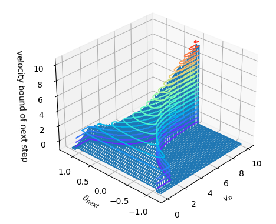
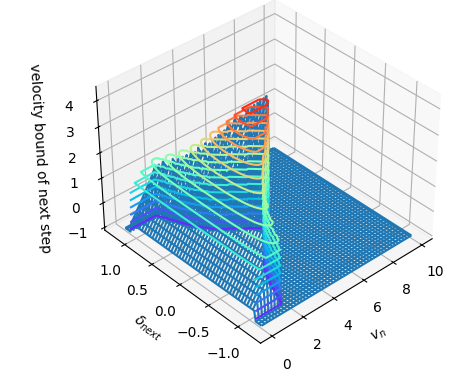

# 차량 state에 따른 다음 제어 주기에서의 안전 속도 영역.

## 배경

F1Tenth 대회를 나가려고 여러 패키지를 이어 붙이다가 local planner가 속도를 말도 안되게 주어 미끄러지는 것을 보았다.  
미끄러지는 것을 막고자 로직을 수정하려 하였으나 아무것도 못 건드릴 것같아서 add-on 타입의 속도 제한 코드를 만들어 달았다.  
생각보다 좋은 성능에 기분이 좋았으나, 기존 코드는 꽤나 러프한 가정을 사용하여 만든 것이었다.  
따라서, 조금 더 엄밀한 가정을 사용하여 그 로직을 개선하고자 본 코드를 작성하였다.

## 가정

1. 가속과 코너링에 의한 힘이 최대 정지마찰력($F_f$)을 넘지 않는다. (=:안전하다)

$$F_{\text{total}} \leq F_f$$

2. 바퀴는 미끄러지지 않는다. (정지 마찰만 고려한다.)
3. 차량은 bicycle model이다. (조향각 $\delta$에 따른 회전 반경 $r$은 bicycle model로 구한다. $L$ : wheelbase)

$$r=\frac{L}{\tan|\delta|}$$

4. 마찰력은 한 점에서 작용하는 것으로 간주한다.
5. 가속력과 원심력은 서로 직교한다.

$$F_c^2+F_a^2 = F_{\text{total}}^2$$

6. 이 차량을 이산적으로 속도 제어한다.
7. 이 차량의 최대 조향각속도($\omega$), 최대 조향각($\delta_M$), 현재 속도($v_n$), 다음 제어 주기때의 조향각($\delta_{n+1}$), 정지 마찰 상수와 중력상수의 곱($\mu g$), wheelbase($L$)는 모두 주어져있다.

## 전개

위 1-5번 가정들에 의해 다음 식을 유도할 수 있다.

원심력 : $F_c := \dfrac{mv^2}{r}= \dfrac{mv^2\tan|\delta|}{L}$  
가속력 : $F_a := ma$  
최대 정지 마찰력 : $F_f=\mu m g$

$$
\begin{align*}
    F_c^2+F_a^2 &\leq F_f^2 \\
    m^2\left(\frac{v^4 \tan^2|\delta|}{L^2}+a^2\right) &\leq\mu^2m^2g^2 \\
    \frac{v^4 \tan^2|\delta|}{L^2}+a^2 &\leq\mu^2g^2
\end{align*}
$$

이 식을 이산화한다.

$$\frac{v_{n+1}^4 \tan^2|\delta_{n+1}|}{L^2}+\left(\frac{v_{n+1}-v_{n}}{\Delta t}\right)^2 \leq(\mu g)^2\quad\because a=\frac{v_{n+1}-v_{n}}{\Delta t}$$

이 식을 다음 제어 주기의 속도 $v_{n+1}$에 대해 정리하면 다음과 같다.

$$
\begin{align*}
    &f(v_{n+1})=\sum_{i=0}^{4}A_{i}v_{n+1}^{i} \leq 0\\
    &A_4 = \left(\frac{\tan|\delta_{n+1}|}{L}\right)^2, \quad A_3 = 0, \quad A_2 = \frac{1}{\Delta t^2} \\
    &A_1 = -\frac{2v_n}{\Delta t^2}, \quad A_0 = \frac{v_n^2}{\Delta t^2}-(\mu g)^2
\end{align*}
$$

이 사차함수 $f(x)$는 최고차항이 항상 0 이상이고, 이계도함수가 항상 0을 초과하므로 변곡점이 없다. 따라서, 사차 방정식 $f(x)=0$는 실근을 최대 2 개까지 가질 수 있으며 위 부등식은 그 두 해 사이의 범위와 같다.

이 점을 이용하여 빠르게 $v_{n+1}$의 범위를 구한다. (numpy 이용.)

따라서 위 부등식을 다음과 같이 정리할 수 있다.

$$v_m \leq v_{n+1} \leq v_M$$

이는 `SafeCar.make_velo_bound_next_step()` 함수에 구현되어있다.

### 추가 논의

그러나 위에서 논한 것 만으로는 조향각속도를 최대로 하는 조작에서 안전성을 보장할 수 없다. (최대한 빠르게 운전대를 돌리는 상황을 상상해보자.)

따라서 조향각속도를 최대로 하는 조작을 하였을 때 끝에 미끄러지는 상황에 도달하는 state는 안전 영역에서 제거할 필요성이 있었다. 이것을 알아내기 위해 다음 함수 `SafeCar.is_pass_worst_case_test()`를 구현하였다.

> `SafeCar.is_pass_worst_case_test()` :  
> 이 함수는 차량의 state를 받고 조향각속도를 최대로 하며 그에 따른 감속을 하는 조작을 각 스텝별로 넣어 그 조향각이 최대 조향각에 도달할 때까지 시뮬레이션 한다.  
> (최대 조향각인 상황에서 안전하면 더이상 조향각은 변하지 않으며, 이후로는 모두 속도에 의해서만 미끄러짐이 결정되기 때문이다. 이것은 이미 `SafeCar.make_velo_bound_next_step()` 함수가 고려한다.)  
> 그때 계속 안전하면 True를, 언젠가 안전하지 않으면 False를 반환한다.

따라서 이 함수를 사용하여 어떤 state가 worst case에서 위험한지 판단할 수 있다.

이때, 어떤 state에서 worst case에 대해 최소 속도는 safe하지만 최대 속도는 unsafe할 수 있다. 이때 safe한 최대 속도를 찾기 위해 이진탐색을 진행하여 worst case에 대해 안전한 최대 속도를 찾는 함수 `SafeCar.make_velo_bound_with_worst_case()`를 작성하였다.

이 함수를 사용하면 어떤 state에서 worst case를 고려했을 때도 안전한 다음 step의 속도 영역을 얻을 수 있다.

- 이 이미지에서 무지개색 등고선이 그 state에서 다음 step에 낼 수 있는 최대 속도이며, 파란색 그물이 최소 속도이다. -1인 값들은 안전하지 않은 영역을 나타낸다.

### 파이썬은 너무 느려!

아무래도 python을 차량에 올려 돌리기엔 너무 느리다.  
그래서 cpp로 똑같은 기능을 만들어 구현하였으며, 이를 python에서 사용할 수 있도록 구성하였다.  
속도를 비교해보면 대략 250배정도 cpp가 더 빠르다.  
물론 하드웨어에 따라 속도가 달라질 수 있으니 테스트 환경을 명시한다.

**테스트 환경**

> 프로세서: Intel(R) Core(TM) i7-10700 CPU @ 2.90GHz 2.90 GHz  
> 설치된 RAM: 16.0GB(15.9GB 사용 가능)  
> OS: Windows 11 Home(24H2) + WSL2 ubuntu 20.04(LTS)

## How to use?

1. devcontainer 환경을 실행시킨다.
2. `poetry install`입력하여 필요한 파이썬 패키지를 설치한다.
3. `./run.sh`입력하여 실행.
